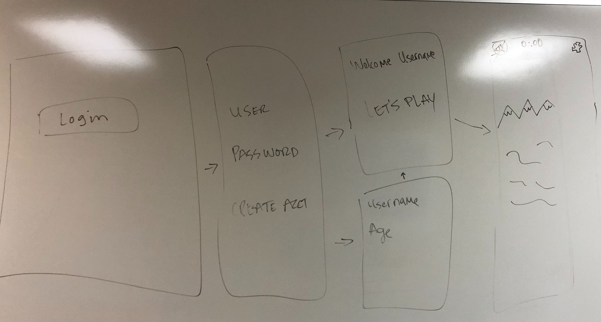
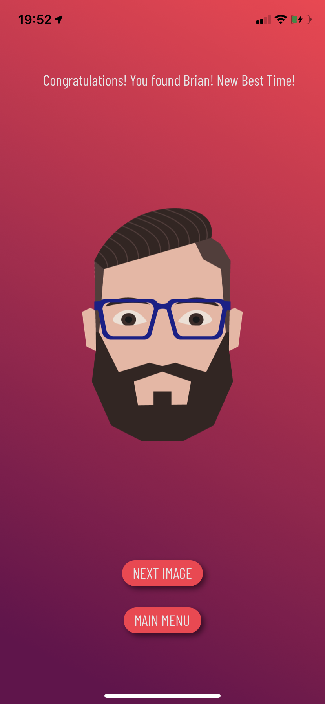

# WEEK 1 DELIVERABLES
* Plan
* Design
* Research

## .find() Mobile App Idea
The main idea behind Project 3 is to create a Mobile game app that will display a picture with a hidden character using React and React Native.

The past two projects we have been working with Web Apps, so we decided on the Final project to try something different.

## Value:
* Entertainment
* Encourages kids and adults to persevere and deeper focus if they cannot find the object or character right away. This packed seek-and-find game takes patience and effort.
* Setting Elapse 

## First whiteboard skteches of the app below: 

## Project Management Board: (screenshot): 
    Summer lemonade color schemes

## Landing Screen:
* Title
* Instructions - * In progress* 
* Login/Create Account

   

## Welcome User:
* Start Button

 

## Game Play:
* Randomized Image 
* On Image load, 'Best Time' shown if available. 
* Settings button includes (Timer should stop when on settings page): 
    - Mute
    - Instructions
    - Exit Game
   
    
   

## Success Screen: 
* Animation Effect
* Time Elapsed
* Best Time
* Play Again Button

 

## Fail Screen:
* Animation Effect
* Too Many Clicks
* New Image Generator Button

Image not available:
   

### Stretch Goals: 
* Rating
* Audio for touches

## Techologies:

<li><strong><a href="https://www.adobe.com/products/illustrator.html?gclid=EAIaIQobChMIw52uk6Ck5QIVAtlkCh27_Q4FEAAYASAAEgIyCPD_BwE&sdid=KKQML&mv=search&ef_id=EAIaIQobChMIw52uk6Ck5QIVAtlkCh27_Q4FEAAYASAAEgIyCPD_BwE:G:s&s_kwcid=AL!3085!3!332938048272!e!!g!!illustrator">Adobe Illustrator</a></strong>

<li><strong><a href="https://projects.invisionapp.com/share/65UFNG4G3ZB#/screens/">InVision</a></strong>

<li><strong><a href="https://facebook.github.io/react-native/showcase">React Native</a></strong>

 <!-- <li><strong><a href="https://facebook.github.io/react-native/showcase">React Native</a></strong> -->

## Dev Team / Roles: 
<li><strong><a href="https://github.com/edepaolo">Eddie</a></strong> 
<li><strong><a href="https://github.com/annda7">Saranda</a></strong> 
 <li><strong><a href="https://github.com/lexi-winstanley">Lexi</a></strong>
