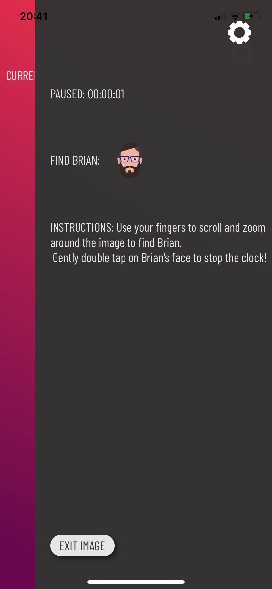

# project3

## .find() Mobile App Idea <h2>

The main idea behid Project 3 is to create a Mobile game app that will display a picture with a hidden character using React and React Native.

The past two projects we have been working with Web Apps, so we decided on the Final project to try something different.

## Value:
* Entertainment
* Encourages kids and adults to persevere and deeper focus if they cannot find the object or character right away. This packed seek-and-find game takes patience and effort.
* Setting Elapse 

## First whiteboard skteches of the app below: 

## Project Management Board: (screenshot)
    Summer lemonade color schemes

## Landing Screen:
* Title
* Instructions - * In progress* 
* Login/Create Account

   

## Welcome User:
* Start Button

 

## Game Play
* Randomized Image 
* On Image load, 'Best Time' shown if available. 
* Settings button includes (Timer should stop when on settings page): 
    - Mute
    - Instructions
    - Exit Game
    - Best Time
    
     

* Dev Team / Roles: 
   * Eddie
   * Saranda
   * Lexi
